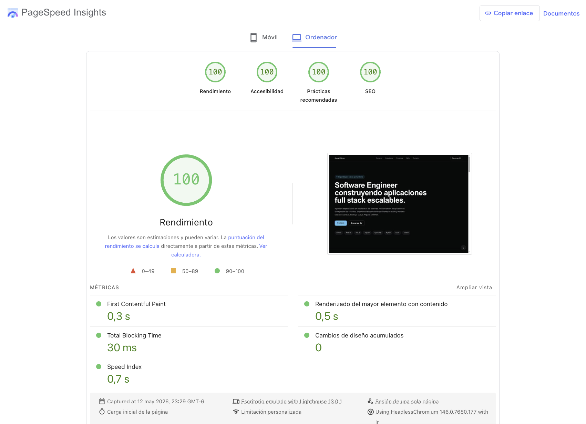

# Portafolio Personal (Nuxt 4)

## Descripción

Este proyecto es un portafolio personal desarrollado con **Nuxt 4, Vue 3 y TailwindCSS**, enfocado en mostrar experiencia profesional, proyectos y habilidades como Ingeniero de Software Full Stack.

Representa una evolución desde una versión previa en HTML/CSS/JavaScript hacia una arquitectura moderna basada en componentes, mejorando escalabilidad, mantenibilidad y rendimiento.

## Sitio en vivo

https://jesus-chicho-hernandez.netlify.app

## Stack tecnológico

- Nuxt 4
- Vue 3
- TypeScript
- TailwindCSS
- Netlify

## Características principales

- Arquitectura modular basada en componentes reutilizables
- Diseño responsive (mobile-first)
- Optimización SEO (meta tags, Open Graph, Twitter Cards)
- Mejora en performance y organización del proyecto
- UI limpia enfocada en UX
- Deploy automático en Netlify (CI/CD)

## Estructura del proyecto

```
app/
├── components/
│   ├── layout/
│   ├── sections/
│   └── ui/
├── pages/
├── layouts/
├── assets/
└── app.vue
```

## Objetivo del rediseño

- Migrar de HTML/CSS/JS a un framework moderno (Nuxt)
- Mejorar mantenibilidad y escalabilidad del código
- Optimizar estructura de componentes
- Mejorar experiencia de usuario y consistencia visual

## Capturas del proyecto

### Antes (versión HTML/CSS/JS)


### Después (Nuxt 4)



## Verificar rendimiento

https://pagespeed.web.dev/analysis/https-jesus-chicho-hernandez-netlify-app/12dbil87sn?hl=es&form_factor=desktop


## Versión en inglés

La documentación en inglés se encuentra en:

- [Readme](./docs/README.en.md)

## Instalación

```bash
git clone https://github.com/JesusLBS/personal-portfolio-website.git
cd personal-portfolio-website
npm install
npm run dev
```

## Build

```bash
npm run build
npm run preview
```

## Despliegue

Deploy automático mediante Netlify CI/CD.

## Licencia

Todos los derechos reservados. Copyright © 2026 Jesus Chicho Hernández.

Este proyecto es de uso personal. No está permitido copiar, modificar, distribuir, sublicenciar, vender ni utilizar el código, diseño, recursos o documentación con fines comerciales o de redistribución sin autorización previa y por escrito del autor.

El software y su contenido están protegidos por las leyes de derechos de autor y propiedad intelectual aplicables.
