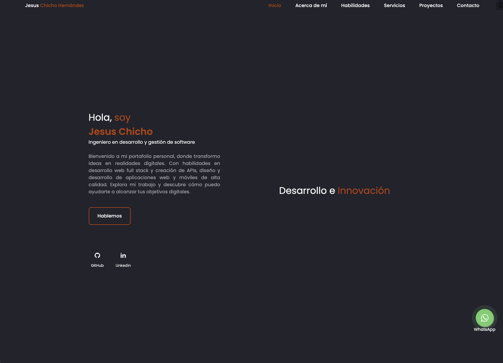
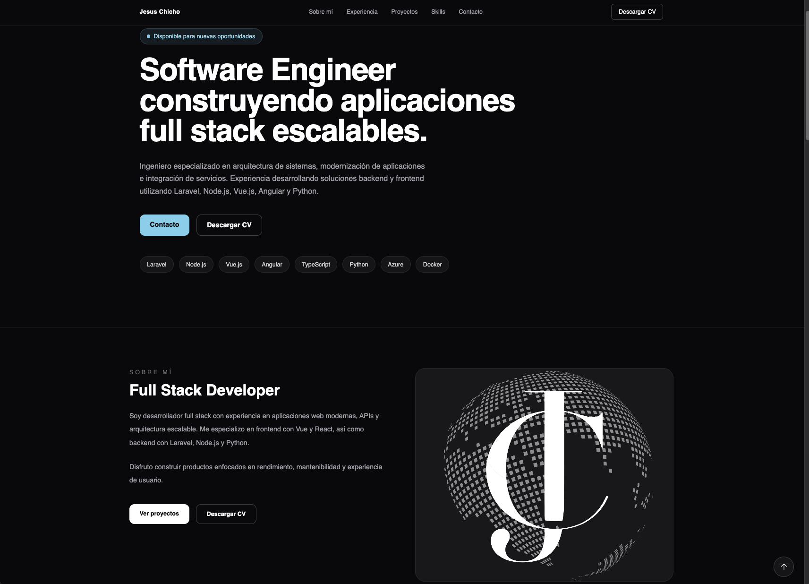

# Personal Portfolio (Nuxt 4)

## Description

This is a personal portfolio project built with **Nuxt 4, Vue 3, and TailwindCSS**, focused on showcasing professional experience, projects, and technical skills as a Full Stack Software Engineer.

It represents an evolution from a previous HTML/CSS/JavaScript version into a modern component-based architecture, improving scalability, maintainability, and performance.

## Live Site

https://jesus-chicho-hernandez.netlify.app

## Tech Stack

- Nuxt 4
- Vue 3
- TypeScript
- TailwindCSS
- Netlify

## Key Features

- Modular architecture using reusable Vue components
- Responsive mobile-first design
- SEO optimization (meta tags, Open Graph, Twitter Cards)
- Improved performance and project structure
- Clean UI focused on usability and user experience
- Continuous deployment via Netlify CI/CD

## Project Structure

```
app/
├── components/
│   ├── layout/
│   ├── sections/
│   └── ui/
├── pages/
├── layouts/
├── assets/
└── app.vue
```

## Redesign Purpose

- Migrate from static HTML/CSS/JS to a modern Nuxt-based architecture
- Improve maintainability and scalability
- Enhance component structure and reuse
- Improve UI consistency and user experience

## Screenshots

### Before (HTML/CSS/JS version)


### After (Nuxt 4 version)


## Check performance

https://pagespeed.web.dev/analysis/https-jesus-chicho-hernandez-netlify-app/12dbil87sn?hl=es&form_factor=desktop

## Spanish Documentation

The Spanish version of this documentation is available in:

- [Readme](../README.md)

## Installation

```bash
git clone https://github.com/JesusLBS/personal-portfolio-website.git
cd personal-portfolio-website
npm install
npm run dev
```

## Build

```bash
npm run build
npm run preview
```

## Deployment

Automatically deployed using Netlify CI/CD pipeline.

## License

All rights reserved. Copyright © 2026 Jesús Chicho Hernández.

This project is for personal use only. It is not permitted to copy, modify, distribute, sublicense, sell, or use the code, design, resources, or documentation for commercial or redistribution purposes without the author's prior written authorization.

The software and its content are protected by applicable copyright and intellectual property laws.